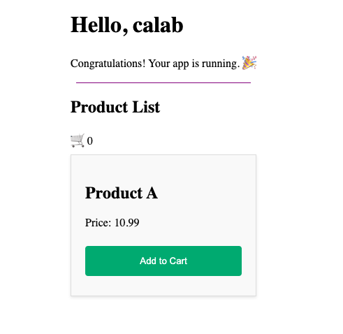

# Create a New Angular Template

## 1. Setup Project

### 1.1 Install Dependencies

1. Change directory to `calab`:

    ```.sh
    cd calab
    ```
2. Install dependencies by running the following command:

    ```.sh
    npm install
    ```
3. You should see a message in your Terminal confirming the npm packages were installed successfully:
    []() 

### 1.1 Start The Application

1. Start Angular Development Server if not yet started:

    ```.bash
    npx -p @angular/cli ng serve
    ```
    > _Otherwise refresh the browser tab to see updated view._

2. You should see the following getting rendered in your browser:

    []() 

    > _You should see similar view to where you left off in previous lab._


## 2. Create Templates

### 2.1 Update Template For Product Component
1. Open `src/app/components/product/product.component.css` file and do the following:
    - Create a `product-details` css class selector:
        ```.css
        .product-details {
            background-color: #f9f9f9;
            padding: 20px;
            margin: 8px 0;
            border: 1px solid #ddd;
            box-shadow: 0 2px 4px rgba(0, 0, 0, 0.1);
        }
        ```
    - Create a `button-add-to-cart` css class selector:
        ```.css
        .button-add-to-cart {
            width: 100%;
            background-color: #04AA6D;
            color: white;
            padding: 14px 20px;
            margin: 8px 0;
            border: none;
            border-radius: 4px;
            cursor: pointer;
        }
        
        .button-add-to-cart:hover {
            background-color: #45a049;
        }
        ```

2. Open `src/app/components/product/product.component.html` file and do the following:
    - Update current HTML with css class selectors created in previous step:
    
        ```.html
        <div class="product-details">
            <h2>{{ product.name }}</h2>
            <p>Price: {{ product.price }}</p>
            <button class="button-add-to-cart" (click)="onAddToCartClicked()">Add to Cart</button>
        </div>
        ```

### 2.2 Update Template For Product List Component

1. Open `src/app/components/product-list/product-list.component.html` file and do the following:
    - Update current HTML with the following:
    
        ```.html
        <div>
            <h2>Product List</h2>
            🛒 {{cart.length}}
            <app-product [product]="product"(addToCartEvent)="addToCart($event)"></app-product>
        </div>
        ```

### 2.3 Start The Application

1. Start Angular Development Server if not yet started:

    ```.bash
    npx -p @angular/cli ng serve  --host 0.0.0.0 
    ```
    > _Otherwise refresh the browser tab to see updated view._

2. You should see the following getting rendered in your browser:

    []() 


## 3. Template Control Flow

### 3.1 Modify Product List Template To Conditionaly Display Cart Value

1. Open `src/app/components/product-list/product-list.component.html` file and do the following:
    - Update current HTML that displays cart count to include Angular built-in control flow block that allows conditionaly display elements:

        ```.html
        @if (cart.length > 0) {
            🛒 {{cart.length}}
        } @else {
            🛒 Empty
        }
        ```

### 3.1 Modify Product List Template To Render List Of Products

1. Open `src/app/components/product-list/product-list.component.ts` file and do the following:
    - Replace `product` variable with list of products:

        ```.ts
        products: Product[] = [
            new Product('Product A',  10.99), 
            new Product('Product B',  7.59), 
            new Product('Product C',  3.20)
        ];
        ```
2. Open `src/app/components/product-list/product-list.component.html` file and do the following:
    - Update current HTML to include Angular built-in control flow block that allows repeatedly display `<app-product>` elements:

        ```.html
        @for (product of products; track product) {
            <app-product [product]="product" (addToCartEvent)="addToCart($event)"></app-product>
        }
        ```

### 3.4 Instpect Changes

1. Start Angular Development Server if not yet started:

    ```.bash
    npx -p @angular/cli ng serve
    ```
    > _Otherwise refresh the browser tab to see updated view._

2. You should see the following getting rendered in your browser:

    []() 