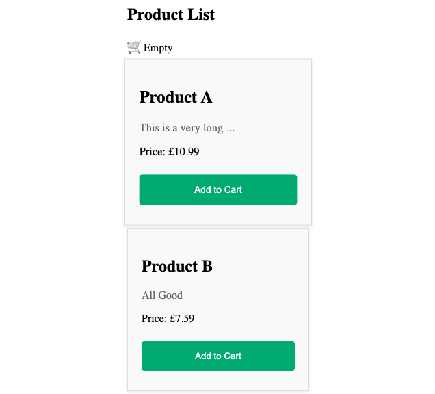

# Create Custom Directives

## 1. Setup Project

### 1.1 Install Dependencies

1. Change directory to `calab`:

    ```.sh
    cd calab
    ```
2. Install dependencies by running the following command:

    ```.sh
    npm install
    ```
3. You should see a message in your Terminal confirming the npm packages were installed successfully:
    []() 

### 1.1 Start The Application

1. Start Angular Development Server if not yet started:

    ```.bash
    npx -p @angular/cli ng serve
    ```
    > _Otherwise refresh the browser tab to see updated view._

2. You should see the following getting rendered in your browser:

    []() 

    > _You should see similar view to where you left off in previous lab._

## 2. Custom Attribute Directive​

### 2.1 Create Custom Attribute Directive

- Create a new drirective called `ZoomOnHoover` using CLI:

    ```.sh
    npx -p @angular/cli ng generate directive directives/zoom-on-hoover
    ```

- Open `src/app/directives/zoom-on-hoover.directive.ts` file and add the following code:

    ```.js
    import { Directive, ElementRef, HostListener } from '@angular/core';

    @Directive({
    selector: '[appZoomOnHoover]',
    standalone: true
    })
    export class ZoomOnHooverDirective {
        constructor(private elRef: ElementRef) {}

        @HostListener('mouseover')
        onMouseOver() {
            this.elRef.nativeElement.style.transform = 'scale(1.03)';
        }

        @HostListener('mouseout')
        onMouseOut() {
            this.elRef.nativeElement.style.transform = 'scale(1)';
        }
    }
    ```
    > _This directive uses the @HostListener decorator to listen for the mouseover and mouseout events on the host element. When the pointer hovers over the element decorated with this directive, the directive scales it up by 3% using the CSS transform property. When the pointer leaves the card, the directive resets the scale back to its original value._

### 2.2 Import Attribute Directive Into Component

1. Open `src/app/components/product/product.component.ts` file do the following:

    - Import `ZoomOnHooverDirective`:

        ```.js
        import { ZoomOnHooverDirective } from '../../directives/zoom-on-hoover.directive';
        ```
    - Update Imports array with `ZoomOnHooverDirective`

        ```.js
        imports: [CurrencyPipe, TruncatePipe, ZoomOnHooverDirective],
        ```

1. Open `src/app/components/product/product.component.html` file and and apply `ZoomOnHoover` directive to an element.​:

    ```.html
    <div class="product-details" appZoomOnHoover>
    ```

### 2.2 Instpect Changes

1. Start Angular Development Server if not yet started:

    ```.bash
    npx -p @angular/cli ng serve
    ```
    > _Otherwise refresh the browser tab to see updated view._

2. You should see the following getting rendered in your browser:

    []() 

    > _Note how product card zooms in once hovered over._


## 3. Custom Structural Directive​

### 3.1 Create Custom Attribute Directive
- Create a new drirective called `Tooltip` using CLI:

    ```.sh
    npx -p @angular/cli ng generate directive directives/tooltip 
    ```

- Open `src/app/directives/tooltip.directive.ts` file and add the following code:
    ```.js
    import { Directive, ElementRef, Input, Renderer2 } from "@angular/core";

    @Directive({
        selector: '[appTooltip]',
        standalone: true
    })
    export class TooltipDirective {
        @Input('appTooltip') tooltipText!: string;
        tooltipElement = this.renderer.createElement('span');

        constructor(private el: ElementRef, private renderer: Renderer2) {
            this.renderer.listen(this.el.nativeElement, 'mouseover', () => {
                this.showTooltip();
            });
            this.renderer.listen(this.el.nativeElement, 'mouseout', () => {
                this.hideTooltip();
            });
        }

        showTooltip() {
            this.renderer.appendChild(this.el.nativeElement, this.tooltipElement);
            this.renderer.setProperty(this.tooltipElement, 'textContent', this.tooltipText);

            const tooltipStyle: any = {
            'position': 'absolute',
            'padding': '10px',
            'border-radius': '5px',
            'background-color': '#333',
            'color': '#fff',
            'font-size': '14px'
            };
            Object.keys(tooltipStyle).forEach(style => {
            this.renderer.setStyle(this.tooltipElement, style, tooltipStyle[style]);
            });
        }

        hideTooltip() {
            this.renderer.removeChild(this.el.nativeElement, this.tooltipElement);
        }
    }
    ```

    - The @Input('appTooltip') tooltipText!: string; decorator allows the tooltip text to be passed in from the template.
    - In the constructor, two event listeners are set up for the element: mouseover and mouseout. When these events occur, the showTooltip() or hideTooltip() methods are called respectively.
    - The showTooltip() method creates a new HTML span element (this.tooltipElement) and appends it to the host element using the Renderer2's appendChild() method. It then sets the text content of the tooltip element using setProperty(), and applies some styles to the tooltip element using the setStyle() method.
    - The hideTooltip() method removes the tooltip element from the host element using the Renderer2's removeChild() method.


### 3.2 Import Structural Directive Into Component

1. Open `src/app/components/product/product.component.ts` file and 

    - Import `TooltipDirective`:

        ```.js
        import { TooltipDirective } from '../../directives/tooltip.directive';
        ```

    - Update Imports array with `TooltipDirective`

        ```.js
        imports: [CurrencyPipe, TruncatePipe, ZoomOnHooverDirective, TooltipDirective],
        ```

1. Open `src/app/components/product/product.component.html` file and and apply `Tooltip` directive to an element.​:

    ```.html
    <p class="product-description" [appTooltip]="product.description">{{ product.description | truncate}}</p>
    ```

### 3.3 Instpect Changes

1. Start Angular Development Server if not yet started:

    ```.bash
    npx -p @angular/cli ng serve
    ```
    > _Otherwise refresh the browser tab to see updated view._

2. You should see the tooltip once hover over the truncated description in a product card:

    []() 